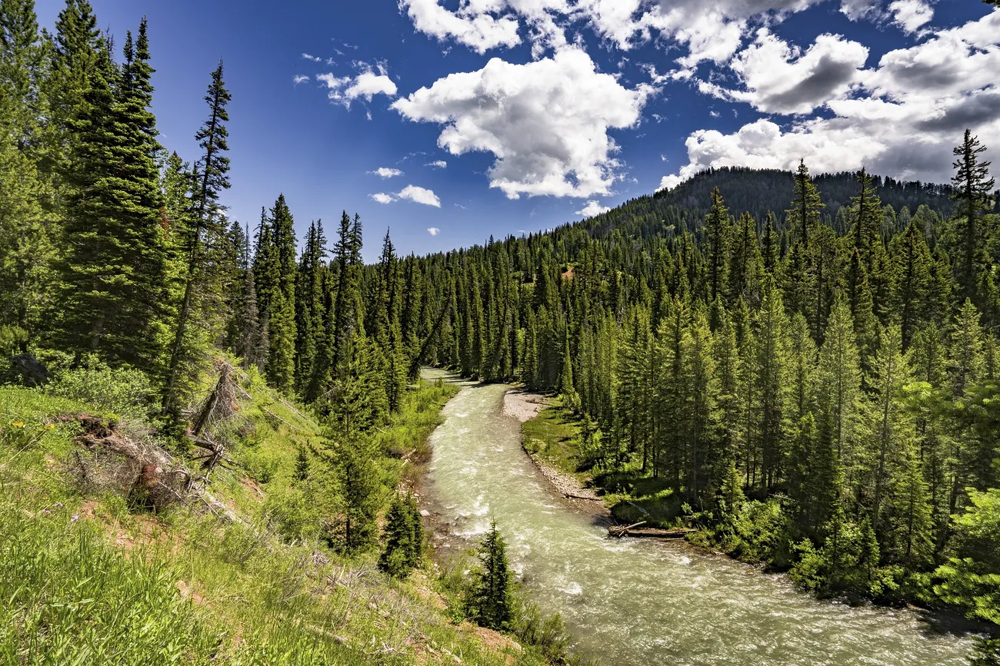

# Trophic niche expansion along streams

Respoitory for R code accompanying:

[Maitland, BM](https://bryan-m-maitland.netlify.app/) & [Rahel, FJ](http://www.uwyo.edu/frahel/). Aquatic food web expansion and trophic redundancy along the Rocky Mountain—Great Plains ecotone. **Currently under consideration at *Ecology*.**

Please note data had yet to be uploaded. 